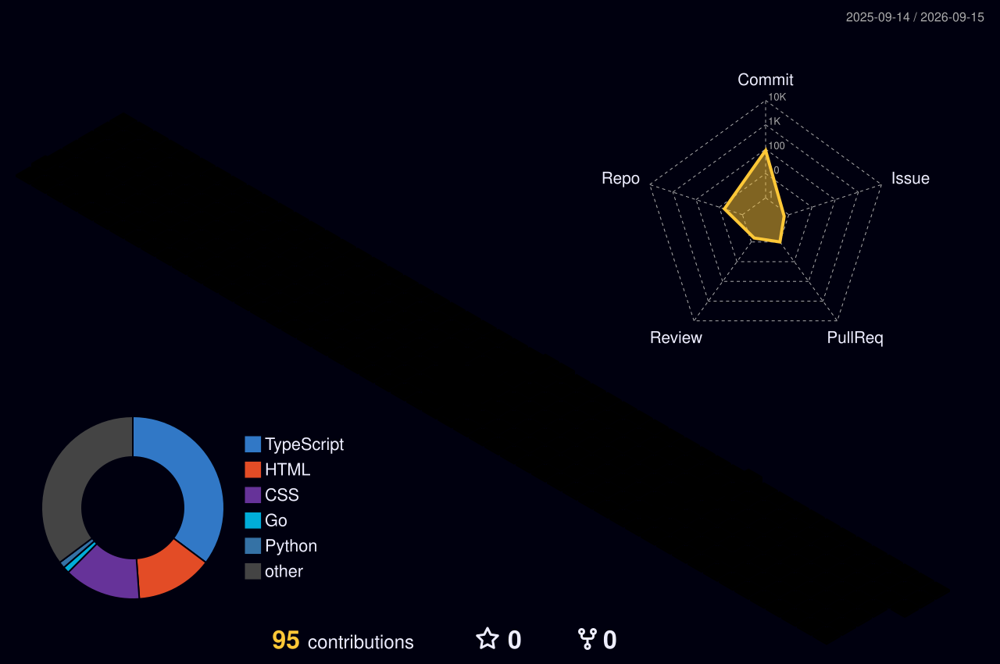

<div align="center">

```
███████╗ █████╗ ██████╗ ███████╗███╗   ██╗
╚══███╔╝██╔══██╗██╔══██╗██╔════╝████╗  ██║
  ███╔╝ ███████║██║  ██║█████╗  ██╔██╗ ██║
 ███╔╝  ██╔══██║██║  ██║██╔══╝  ██║╚██╗██║
███████╗██║  ██║██████╔╝███████╗██║ ╚████║
╚══════╝╚═╝  ╚═╝╚═════╝ ╚══════╝╚═╝  ╚═══╝
```

### `> Nguyen Hoai Thuong` — AI Fullstack Developer

[](https://git.io/typing-svg)

[](https://hoaithuong81.id.vn/)
[](mailto:thuonggg81@gmail.com)
[](https://github.com/zaden81)

</div>

---

## `experience`

**DFCFlow** · AI Fullstack Developer

- Architected and built frontend admin dashboard following best practices — component design, type-safe API integration, state management
- Analyzed business logic and designed API contracts between frontend and AI backend services
- Wrote and optimized prompts for a multi-agent chatbot system — covering intent routing, response formatting, and agent coordination
- Tuned RAG pipeline to improve retrieval accuracy for domain-specific knowledge


---

## `whoami`

<table>
<tr>
<td valign="top" width="60%">

```python
class Zaden:
    name     = "Nguyen Hoai Thuong"
    alias    = "zaden"
    role     = "AI Fullstack Developer"
    focus    = ["Computer Vision", "Deep Learning", "Web Applications"]
    stack    = {
        "AI/ML"    : ["PyTorch", "TensorFlow/Keras", "YOLOv8", "OpenCV"],
        "Backend"  : ["Python", "Flask", "FastAPI", "SQLAlchemy"],
        "Frontend" : ["HTML/CSS", "JavaScript"],
        "Database" : ["PostgreSQL", "SQLite"],
        "DevOps"   : ["Docker", "Gunicorn", "Render"],
    }
    currently = "Turning AI models into real products 🚀"
```

</td>
<td valign="top" align="center" width="40%">


</td>
</tr>
</table>

---

## `tech stack`

<div align="center">

**AI / Machine Learning**


**Backend / Web**


</div>

---

## `github stats`

<div align="center">


</div>

---

## `3d contribution`

<div align="center">



</div>

---

<div align="center">


*`> "From zero to deployed — AI that actually works."` *

</div>
